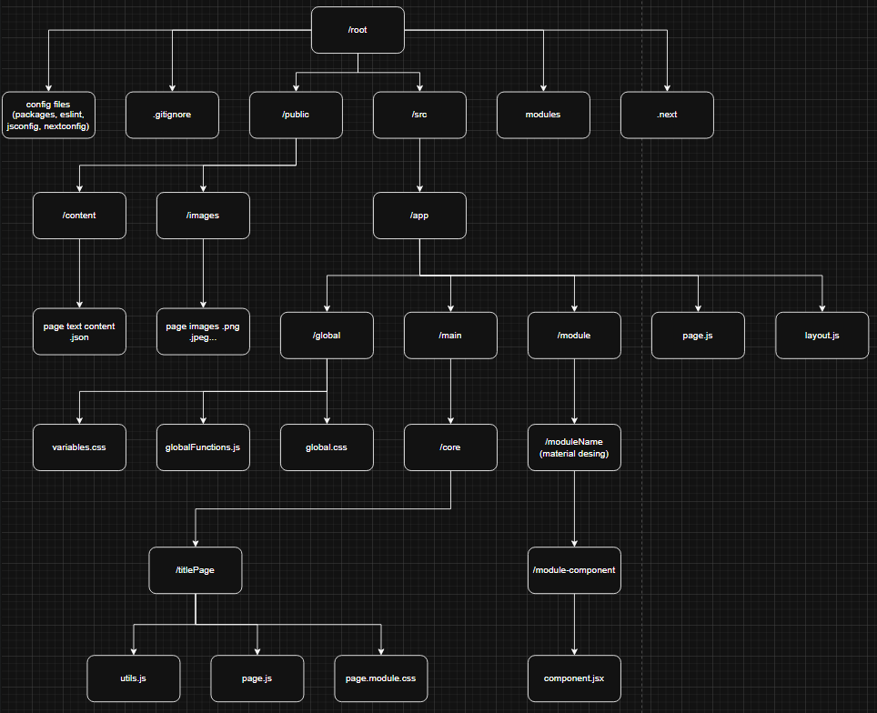

# Introdução

O codigo anexo a esse repositorio consiste no portifolio do Desenvolvedor Pedro Fonseca,
Tem como objetivo mostrar os principais projetos e suas tecnologias.

---

## Tecnologias

As principais tecnologias envolvidas na construção:
- JavaScript
- Html
- Css

Principais frameworks:
- Node.js
- Next.js

Principais bibliotecas:
- React
- Material Desing
- React-router
- Next
- React-scroll

Principais auxiliares:
- eslint
- Visual Studio Code
- Npm
- Github

Versionamento =>

```json
"dependencies": {
    "@emotion/react": "^11.14.0",
    "@emotion/styled": "^11.14.0",
    "@mui/material": "^6.4.3",
    "next": "15.1.6",
    "react": "^19.0.0",
    "react-dom": "^19.0.0",
    "react-scroll": "^1.9.3"
}
```
---

## Arquitetura



---

## Como fazer deploy

É necessário fazer download e instalação do [Node JS](https://nodejs.org/en/download) para execução do projeto.

Após isso, baixar o arquivo do projeto, acessar, iniciar o node com 
`npm init -y`

Isso baixara as dependencias, com tudo instalado rode o comando
`npm run dev` 
dentro da pasta do repositorio, irá subir algumas informações, caso apareça como
```bash
Next.js 15.1.6
   - Local:        http://localhost:3000
```
Seguida de nenhuma mensagem de erro, significa que o codigo subiu corretamente, 
basta colocar o link no seu navegador e acessar a aplicação


## Documentação oficial

[Material Desing](https://mui.com/material-ui/getting-started/installation/)

[Node Js](https://nodejs.org/en/learn/getting-started/introduction-to-nodejs)

[React Router](https://reactrouter.com/home)

[Next Js](https://nextjs.org/docs/app/getting-started/installation)

[React](https://react.dev/)

[NPM](https://docs.npmjs.com/)

[Eslint](https://eslint.org/docs/latest/)

[JavaScript](https://developer.mozilla.org/en-US/docs/Web/JavaScript)


```bash
$ npx create-next-app@latest portifolio
Need to install the following packages:
create-next-app@15.1.6
Ok to proceed? (y) y

√ Would you like to use TypeScript? ... No / Yes
√ Would you like to use ESLint? ... No / Yes
√ Would you like to use Tailwind CSS? ... No / Yes
√ Would you like your code inside a `src/` directory? ... No / Yes
√ Would you like to use App Router? (recommended) ... No / Yes
√ Would you like to use Turbopack for `next dev`? ... No / Yes
√ Would you like to customize the import alias (`@/*` by default)? ... No / Yes
```